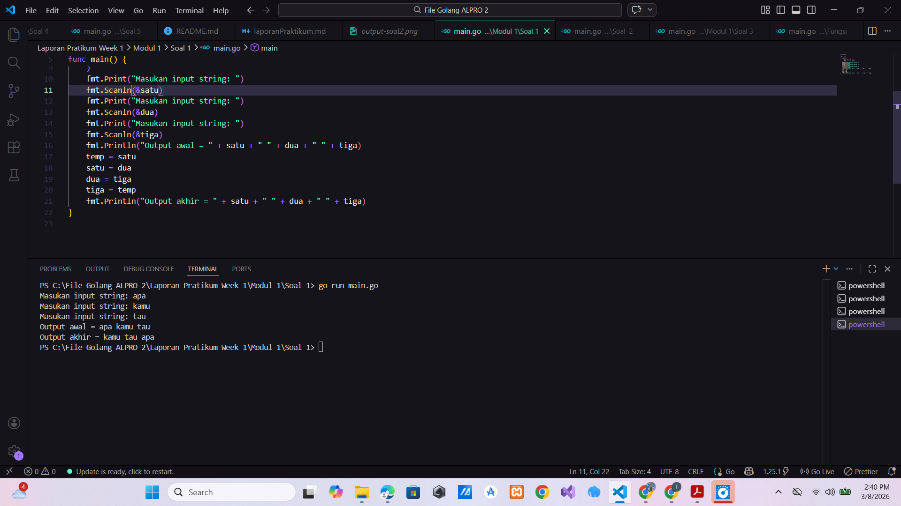
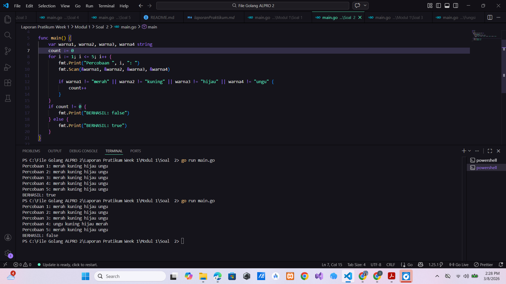
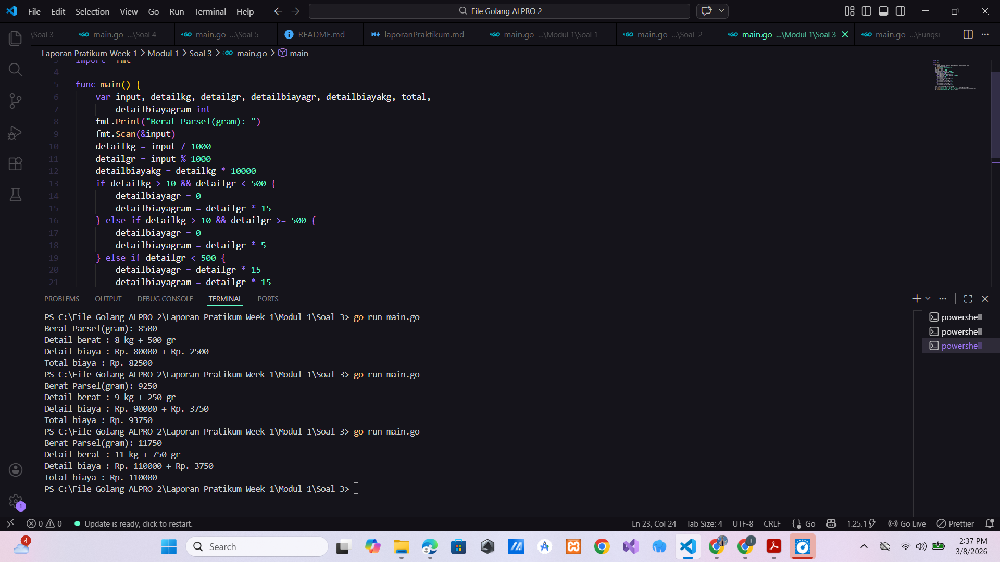

# <h1 align="center">Laporan Praktikum Modul 2 - ... </h1>

<p align="center">Hilkia Farrel Azaria - 109082500205</p>

## Unguided

### 1. [Soal]

#### Modul 2/Soal 2/main.go

```go
package main

import "fmt"

func main() {
	var (
		satu, dua, tiga string
		temp            string
	)
	fmt.Print("Masukan input string: ")
	fmt.Scanln(&satu)
	fmt.Print("Masukan input string: ")
	fmt.Scanln(&dua)
	fmt.Print("Masukan input string: ")
	fmt.Scanln(&tiga)
	fmt.Println("Output awal = " + satu + " " + dua + " " + tiga)
	temp = satu
	satu = dua
	dua = tiga
	tiga = temp
	fmt.Println("Output akhir = " + satu + " " + dua + " " + tiga)
}

```

### Output Unguided :

##### Output


[penjelasan]

### 2. [Soal]

#### Modul 2/Soal 2/main.go

```go
package main

import "fmt"

func main() {
	var warna1, warna2, warna3, warna4 string
	count := 0
	for i := 1; i <= 5; i++ {
		fmt.Print("Percobaan ", i, ": ")
		fmt.Scan(&warna1, &warna2, &warna3, &warna4)

		if warna1 != "merah" || warna2 != "kuning" || warna3 != "hijau" || warna4 != "ungu" {
			count++
		}
	}
	if count != 0 {
		fmt.Print("BERHASIL: false")
	} else {
		fmt.Print("BERHASIL: true")
	}
}

```

### Output Unguided :

##### Output


[penjelasan]

### 3. [Soal]

#### Modul 2/Soal 3/main.go

```go
package main

import "fmt"

func main() {
	var input, detailkg, detailgr, detailbiayagr, detailbiayakg, total,
		detailbiayagram int
	fmt.Print("Berat Parsel(gram): ")
	fmt.Scan(&input)
	detailkg = input / 1000
	detailgr = input % 1000
	detailbiayakg = detailkg * 10000
	if detailkg > 10 && detailgr < 500 {
		detailbiayagr = 0
		detailbiayagram = detailgr * 15
	} else if detailkg > 10 && detailgr >= 500 {
		detailbiayagr = 0
		detailbiayagram = detailgr * 5
	} else if detailgr < 500 {
		detailbiayagr = detailgr * 15
		detailbiayagram = detailgr * 15
	} else {
		detailbiayagr = detailgr * 5
		detailbiayagram = detailgr * 5
	}
	total = detailbiayakg + detailbiayagr
	fmt.Printf("Detail berat : %d kg + %d gr \n", detailkg, detailgr)
	fmt.Printf("Detail biaya : Rp. %d + Rp. %d\n", detailbiayakg, detailbiayagram)
	fmt.Printf("Total biaya : Rp. %d \n", total)
}

```

### Output Unguided :

##### Output


[penjelasan]

Program di atas adalah program biaya pos untuk menghitung biaya pengiriman. Pertama tama
saya membuat varibael dengan tipedata int yaitu input, detailkg, detailgr, detailbiayagr,
detailbiayakg, total, detailbiayagram, setelah itu saya inputan berat parsel dalam gram yang
dimana di simpan di variable input. Lalu saya membuat logika dimana untuk mengambil nilai kg
yaitu input / 1000, lalu saya membuat detailgr atau membuat sisa bagi dari inputan untuk
mengetaui berat gr nya, dan saya membuat detailbiayakg untuk mengetahui harga kilogram nya
lalu saya membuat perkondisian dimana jika detailkg lebih besar dari 10 dan detailgr lebih kecil
dari 500 dia akan membuat detailbiayagr nya menjadi 0 dan menyimpan data ke detailbiayagram
untuk mengetahui berapa harga asli jika biaya gram di kali dengan 15, dan membuat buat kondisi
ke 2 jika detailkg lebih besar dari 10 dan detailgr lebih besar dari 500 dia akan membuat
detailbiayagr nya menjadi 0 dan menyimpan data ke detailbiayagram untuk mengetahui berapa
harga asli jika biaya gram di kali dengan 5, lalu kondisi yang ke 3 jika detailgr lebih kecil dari 500
dia akan membuat detailbiayagr menyimpan data dari perkalian detailgr dikali dengan 15 dan
detailbiayagram menyimpan data dari perkalian detailgr dikali dengan 15, lalu kondisi yang ke
4/semua kondisi tidak tepenuhi jika detailgr lebih besar dari 500 dia akan membuat detailbiayagr
menyimpan data dari perkalian detailgr dikali dengan 5 dan detailbiayagram menyimpan data dari
perkalian detailgr dikali dengan 5. Setelah itu saya membuat pertambahan detailbiayakg +
detailbiayagr lalu saya membuat output fmt.Printf("Detail berat : %d kg + %d gr \n", detailkg,
detailgr) fmt.Printf("Detail biaya : Rp. %d + Rp. %d\n", detailbiayakg, detailbiayagram)
fmt.Printf("Total biaya : Rp. %d \n", total).
